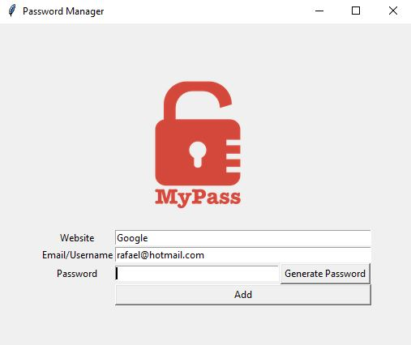

Introdução:

O programa gera uma senha aleatória para o site desejado. Basta colocar o site, o e-mail e clicar em "generate password"

Após o programa gerar a senha, ao clicar em "add" ele adiciona a senha em um arquivo .txt chamado passwords, onde ficam salvas todas as senhas e logins.

